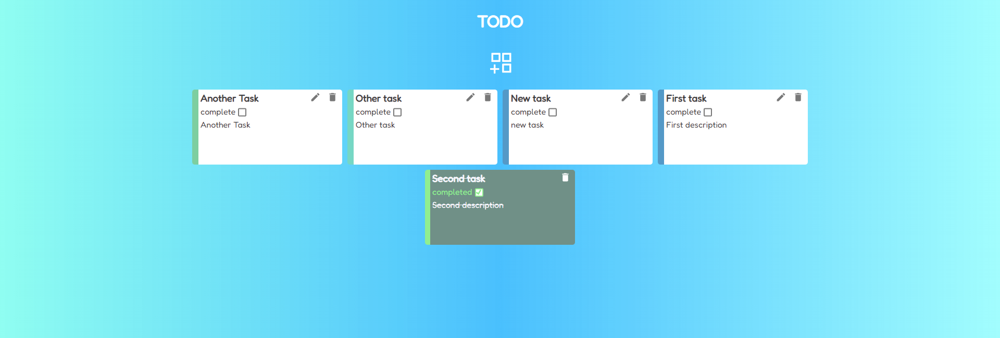
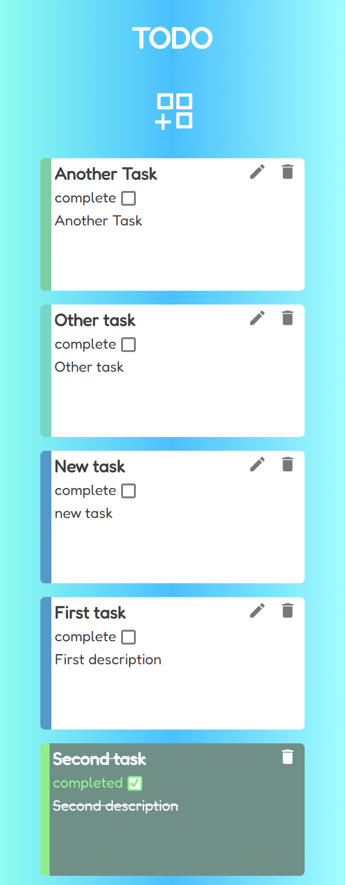
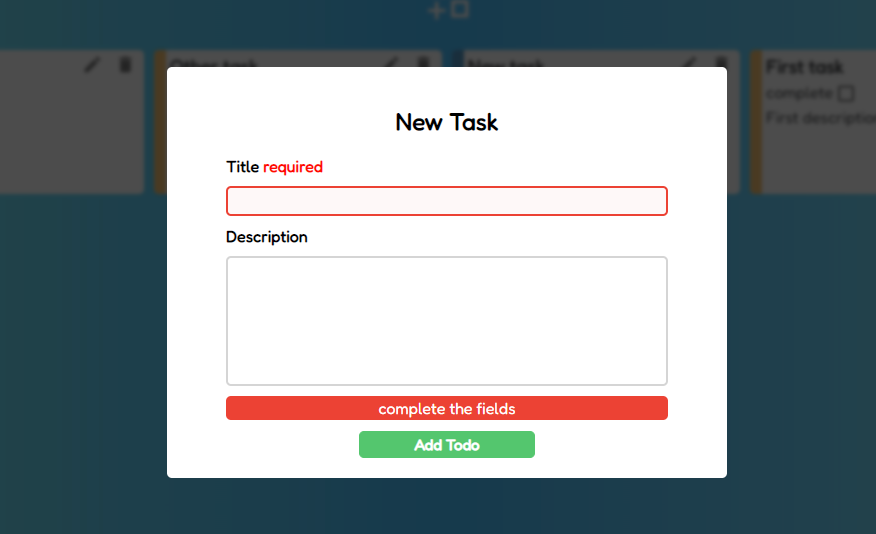

# TODO APP 🚀

_TODO list created with **React**, using hooks and custom hooks, this **TODO APP** has modal and form, this validates inputs, the **Description** is limited in 105 characters and the **Title** is required by default, you can modify the validation changing the pattern on  ListTodo and FormTodo File_







## Clone this repo 🔧


``` bash
$ git clone https://github.com/ryneelcode/todo-app-react.git
$ git clone git@github.com:ryneelcode/todo-app-react.git

# Enter on dir
$ cd todo-app-react

# Install dependencies
$ npm install

# Init dev serve
$ npm run dev
```


## Wiki 📖
_Default sintax of todos_
``` JavaScript
const initialTodos = [
  { id: 3, title: "First task", description: "First description", isCompleted: false },
  { id: 2, title: "Second task", description: "Second description", isCompleted: false }
];
```

_Object syntax to validate input_
``` JavaScript
const initialValues = {
  title: {
    value: "",
    pattern: /^[A-Za-z\s]+$/,
    errorMessage: "letters only",
    isRequired: true,
    isTouched: false
  },
  description: {
    value: "",
    pattern: /^.{0,105}$/,
    errorMessage: "limit 105 characters",
    isRequired: false,
    isTouched: false
  }
};
```


## Built with 🛠️

* [React.JS](https://es.reactjs.org/) - JavaScript library 
* [Vite](https://vitejs.dev/) - Front-end build tool 
* [Postcss](https://postcss.org/) - Development tool to automate routine CSS operations


## Author ✒️

* **Lenny Rodriguez** - *Front-End Developer* - [GitHub](https://github.com/ryneelcode)


## Gratitude 🎁
* Thanks for visit the repo, I'm specializing in **React** and this is my first SPA using the library
---
⌨️ Created with ❤️ by [Lenny](https://github.com/ryneelcode) 😊